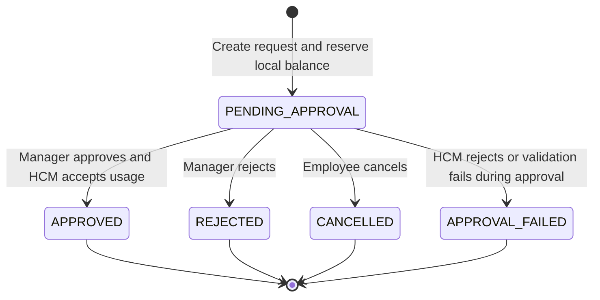

# Time-Off Microservice Technical Requirements Document

## 1. Overview

ExampleHR is the employee-facing interface for time-off requests, while the external Human Capital Management system (HCM), such as Workday or SAP, remains the source of truth for employment and time-off balance data.

The Time-Off Microservice manages the lifecycle of employee time-off requests and maintains balance integrity between ExampleHR and the HCM. The core challenge is that ExampleHR is not the only actor that can affect HCM balances. Balances may change externally through work anniversaries, annual refreshes, HR corrections, or other systems integrated directly with the HCM.

This service must therefore provide fast local user feedback while defensively validating critical state transitions against the HCM.

## 2. Goals

- Allow employees to view time-off balances per employee and location.
- Allow employees to create time-off requests.
- Allow managers to approve or reject pending requests.
- Prevent local overbooking of balances.
- Revalidate balances against the HCM before approval.
- Synchronize local balances from the HCM realtime and batch interfaces.
- Provide a mock HCM implementation for development and test scenarios.
- Provide a robust automated test suite that guards against future regressions.
- Clearly document architectural and security decisions.

## 3. Non-Goals

- Implementing authentication with a production identity provider.
- Implementing a full manager hierarchy or HR organization model.
- Supporting payroll, accrual policies, holidays, partial-day calendars, or country-specific leave laws.
- Supporting multiple HCM vendors with vendor-specific connectors.
- Building a frontend application.
- Deploying the service to a cloud provider.

These areas are intentionally excluded to keep the take-home exercise focused on lifecycle management, balance integrity, synchronization, and test rigor.

## 4. Requirement Traceability

| Exercise Requirement | Proposed Coverage |
| --- | --- |
| Manage time-off request lifecycle | `time_off_requests` model and create, approve, reject, cancel endpoints |
| Maintain balance integrity | Local reservations, HCM revalidation, transactional request creation |
| HCM is source of truth | Local balance is treated as synchronized cache, not canonical truth |
| HCM can change independently | Batch sync and test-only mock HCM balance mutation |
| HCM realtime API | HCM client supports per-employee per-location balance lookup and usage submission |
| HCM batch endpoint | Batch sync imports the full balance corpus |
| HCM errors may not be guaranteed | Defensive local validation and consistency checks |
| Mock HCM endpoints | Dedicated mock HCM module exposed through `/mock-hcm` |
| NestJS and SQLite | NestJS service with SQLite persistence |
| Test rigor | Unit, integration, e2e, concurrency, idempotency, and coverage targets |
| Security and architecture decisions | Dedicated sections for security, alternatives, and operational concerns |

## 5. Technology Decisions

| Area | Decision | Rationale |
| --- | --- | --- |
| Runtime | Node.js | Matches the JavaScript requirement and NestJS ecosystem |
| Framework | NestJS | Explicitly requested by the exercise guide and suitable for modular service design |
| Language | TypeScript | Standard NestJS usage; compiles to JavaScript while reducing DTO, status, and integration mistakes |
| Database | SQLite | Explicitly requested by the exercise guide |
| ORM | Prisma | Clear schema, migrations, typed client, and straightforward test database setup |
| API style | REST | Lower complexity than GraphQL for command-oriented workflows |
| Tests | Jest and Supertest | Standard NestJS testing stack with good e2e support |
| Validation | `class-validator` and `class-transformer` | Conventional NestJS DTO validation |

If the reviewer interprets "JavaScript" as excluding TypeScript, the service can still be described as a JavaScript runtime service. TypeScript is selected because it is the default professional NestJS path and improves maintainability without changing the runtime platform.

## 6. Key Assumptions

- Balances are scoped by `employeeId` and `locationId`, as stated in the exercise.
- A balance represents available time-off days for one employee at one location.
- The service stores day quantities internally as integer units, such as hundredths of a day, instead of JavaScript floating-point values.
- A newly created time-off request reserves local balance while it is pending approval.
- A manager approval attempts to commit the usage to the HCM.
- If the HCM rejects the usage, the local approval must fail.
- If the HCM is unavailable during approval, the request must not be approved.
- Batch synchronization from the HCM can overwrite the local source-of-truth snapshot, but must preserve pending local reservations.
- The mock HCM is part of the repository and is used by automated tests to simulate HCM behavior.

## 7. Actors

### Employee

- Views an available balance.
- Creates a time-off request.
- Cancels a pending request.
- Receives immediate feedback when a request cannot be created due to insufficient locally known balance.

### Manager

- Reviews pending requests.
- Approves or rejects requests.
- Needs confidence that approvals are based on current HCM state.

### HCM

- Owns the canonical balance.
- Exposes realtime APIs for balance lookup and time-off usage submission.
- Exposes a batch endpoint containing the full balance corpus.
- May change balances independently from ExampleHR.
- May return errors for invalid dimensions or insufficient balance, but this cannot be fully trusted, so ExampleHR must validate defensively.

## 8. Business Rules

### Balance Scope

- A balance is uniquely identified by:
  - `employeeId`
  - `locationId`

### Balance Availability

Available local balance is calculated as:

```text
availableBalance = syncedHcmBalance - pendingReservedBalance
```

Where:

- `syncedHcmBalance` is the latest known HCM balance for the employee and location.
- `pendingReservedBalance` is the sum of locally pending requests for the same employee and location.

### Time-Off Request Creation

- A request must include `employeeId`, `locationId`, `startDate`, `endDate`, and `requestedDays`.
- `requestedDays` must be greater than zero.
- `endDate` must not be earlier than `startDate`.
- The employee and location combination must exist in the local balance table or be validated from the HCM before creation.
- The request is rejected if local available balance is insufficient.
- A successfully created request starts in `PENDING_APPROVAL`.
- A pending request reserves local balance immediately.

### Approval

- Only requests in `PENDING_APPROVAL` can be approved.
- Before approval, the service must fetch or validate the latest HCM balance for the request dimensions.
- The service must submit the usage to the HCM.
- If the HCM accepts the usage, the request transitions to `APPROVED`.
- If the HCM rejects the usage due to invalid dimensions or insufficient balance, the request transitions to `APPROVAL_FAILED` or remains pending with an explicit failure record, depending on implementation detail.
- If the HCM is unavailable or times out, the request must not be approved.
- Approval must be idempotent: retrying an already approved request must not double-charge the HCM.

### Rejection

- Only requests in `PENDING_APPROVAL` can be rejected.
- Rejection releases the local reservation.
- Rejected requests must not be submitted to the HCM.

### Cancellation

- Pending requests can be cancelled by the employee.
- Cancelling a pending request releases local reservation.
- Approved request cancellation is out of scope unless explicitly implemented as a reversal against the HCM.

### Batch Synchronization

- The service can request or receive the full HCM balance corpus.
- Local balance rows are upserted by `employeeId` and `locationId`.
- Batch synchronization must not ignore pending local reservations when calculating what employees can still request.
- The service should store sync metadata such as `lastSyncedAt` and source.

### Defensive HCM Handling

- The service must not blindly trust the HCM.
- If the HCM returns malformed, negative, or inconsistent balances, the service should reject or quarantine that data.
- If the HCM accepts a usage that would make the local model inconsistent, the service must record enough information for investigation and avoid hiding the inconsistency.

## 9. Request Lifecycle



## 10. API Design

The service will expose REST endpoints. REST is preferred over GraphQL for this exercise because the domain is command-heavy, the workflows map cleanly to HTTP resources, and REST is easier to inspect and test in a take-home setting.

### Health

```http
GET /health
```

Returns service status and basic dependency health.

### Balances

```http
GET /balances/:employeeId/:locationId
```

Returns the latest local HCM balance, pending reserved balance, and locally available balance.

```http
POST /balances/sync
```

Triggers a batch sync from the mock HCM into the local database.

### Time-Off Requests

```http
POST /time-off-requests
```

Creates a pending request and reserves local balance.

```json
{
  "employeeId": "emp_001",
  "locationId": "loc_ny",
  "startDate": "2026-05-10",
  "endDate": "2026-05-11",
  "requestedDays": 2,
  "idempotencyKey": "emp_001-2026-05-10-2026-05-11"
}
```

```http
GET /time-off-requests/:id
```

Returns a single request.

```http
POST /time-off-requests/:id/approve
```

Approves a pending request after HCM validation and usage submission.

```http
POST /time-off-requests/:id/reject
```

Rejects a pending request.

```http
POST /time-off-requests/:id/cancel
```

Cancels a pending request.

### Mock HCM

The mock HCM can be implemented either as a dedicated NestJS module in the same application under `/mock-hcm` or as a separate lightweight process. For this take-home exercise, a dedicated module is simpler and keeps the test setup reproducible.

```http
GET /mock-hcm/balances/:employeeId/:locationId
```

Returns a realtime HCM balance.

```http
GET /mock-hcm/balances
```

Returns the full balance corpus for batch sync.

```http
POST /mock-hcm/time-off-usages
```

Attempts to consume balance in the HCM.

```http
PATCH /mock-hcm/balances/:employeeId/:locationId
```

Test-only endpoint to simulate external HCM balance changes.

## 11. Data Model

### `balances`

Stores the latest locally synchronized view of HCM balances.

| Field | Type | Notes |
| --- | --- | --- |
| `id` | string | Primary key |
| `employeeId` | string | Required |
| `locationId` | string | Required |
| `balanceUnits` | integer | Available HCM balance in internal units |
| `lastSyncedAt` | datetime | Last successful sync time |
| `createdAt` | datetime | Audit |
| `updatedAt` | datetime | Audit |

Unique constraint:

```text
(employeeId, locationId)
```

### `time_off_requests`

Stores employee requests and lifecycle state.

| Field | Type | Notes |
| --- | --- | --- |
| `id` | string | Primary key |
| `employeeId` | string | Required |
| `locationId` | string | Required |
| `startDate` | date | Required |
| `endDate` | date | Required |
| `requestedUnits` | integer | Required |
| `status` | enum | Request lifecycle state |
| `idempotencyKey` | string | Optional but recommended |
| `hcmTransactionId` | string | Set after successful HCM submission |
| `failureReason` | string | Set after failed approval attempt |
| `createdAt` | datetime | Audit |
| `updatedAt` | datetime | Audit |

Indexes:

- `(employeeId, locationId, status)`
- `idempotencyKey`

### `hcm_mock_balances`

Stores mock HCM balances for development and automated tests.

| Field | Type | Notes |
| --- | --- | --- |
| `id` | string | Primary key |
| `employeeId` | string | Required |
| `locationId` | string | Required |
| `balanceUnits` | integer | Canonical mock HCM balance |
| `createdAt` | datetime | Audit |
| `updatedAt` | datetime | Audit |

## 12. Consistency Strategy

The service uses a local-reservation model.

1. Batch or realtime sync imports the latest known HCM balance.
2. Pending local requests reserve against that imported balance.
3. Approval revalidates against the HCM before committing.
4. Successful approval sends usage to the HCM and updates local request state.
5. Local balance display subtracts pending reservations from the latest synced HCM balance.

This design avoids approving stale data while still giving employees quick feedback during request creation.

## 13. Concurrency Strategy

The highest-risk bug is two simultaneous requests consuming the same balance. The service should protect critical sections with database transactions.

Request creation must:

- Read the current synced balance.
- Sum pending reservations for the same employee and location.
- Validate available balance.
- Insert the pending request.
- Commit atomically.

Approval must:

- Lock or transactionally re-read the request.
- Confirm the request is still `PENDING_APPROVAL`.
- Submit to the HCM with an idempotency key.
- Persist the final state once the HCM response is known.

SQLite has limited write concurrency, but it is sufficient for this exercise when transactions are used consistently.

## 14. Idempotency

Idempotency matters because retries can happen after timeouts or network errors.

The service should support an `idempotencyKey` on request creation. If the same key is submitted again for the same logical operation, the service should return the existing request instead of creating a duplicate reservation.

Approval should also use a deterministic operation key when calling the HCM mock so that retrying approval does not double-consume HCM balance.

## 15. Error Handling

The API should return precise errors:

- `400 Bad Request` for validation errors.
- `404 Not Found` for missing balances or requests.
- `409 Conflict` for invalid state transitions or insufficient balance.
- `422 Unprocessable Entity` for invalid HCM dimensions.
- `503 Service Unavailable` when the HCM is unavailable during an operation that requires it.

Errors should include safe, structured response bodies without leaking stack traces.

## 16. Security Considerations

Even though production authentication is out of scope, the service should still demonstrate security awareness:

- Validate all request DTOs.
- Use explicit allowlisted fields.
- Avoid trusting client-provided status values.
- Avoid exposing internal exception details.
- Keep HCM base URL and timeout values in configuration.
- Do not commit secrets.
- Use dependency injection for the HCM client to enable safe testing.
- Apply rate limiting or document it as a production hardening item.
- Treat mock HCM mutation endpoints as development/test-only.

## 17. Observability and Operational Considerations

For a production version, the service should expose enough signals to detect balance integrity issues early.

- Structured logs for request creation, approval attempts, HCM calls, sync runs, and failed transitions.
- Correlation IDs for tracing a request across API, service, database, and HCM calls.
- Metrics for HCM latency, HCM failures, approval failures, sync duration, and sync record counts.
- Alerts for repeated HCM failures, malformed HCM payloads, and approval failure spikes.
- Audit records for balance-affecting transitions.

For this exercise, the implementation should at least keep error responses structured and preserve enough database state to explain why a request failed.

## 18. Testing Strategy

The test suite is a major evaluation point. It should prioritize business invariants over superficial controller tests.

### Unit Tests

- Balance availability calculation subtracts pending reservations.
- Request creation rejects zero or negative days.
- Request creation rejects date ranges where `endDate` is before `startDate`.
- Request creation rejects insufficient balance.
- State transition rules reject invalid transitions.
- HCM client maps HCM errors into domain errors.

### Integration Tests

- Batch sync imports HCM balances into local balances.
- Batch sync updates an existing balance after an external HCM change.
- Creating a pending request reduces locally available balance.
- Rejecting a request releases the local reservation.
- Cancelling a request releases the local reservation.
- Approving a request consumes HCM balance and marks the request approved.
- HCM insufficient balance during approval prevents approval.
- HCM invalid dimensions during approval prevents approval.
- HCM outage during approval prevents approval.
- Duplicate creation with the same idempotency key returns the existing request.

### Concurrency Tests

- Two simultaneous requests for the same remaining balance cannot both reserve more than available.
- Retrying approval does not double-consume HCM balance.

### Coverage Target

The target coverage should be at least:

- 80% statements
- 80% branches
- 80% functions
- 80% lines

The exact threshold can be enforced through Jest configuration.

## 19. Risk Register

| Risk | Impact | Mitigation |
| --- | --- | --- |
| Stale local balance | Employee sees or reserves more than is truly available | Revalidate against HCM before approval and batch sync regularly |
| Simultaneous requests | Balance can be over-reserved | Use database transactions around availability checks and inserts |
| HCM outage during approval | False approval or inconsistent state | Fail closed and do not approve without HCM confirmation |
| HCM accepts inconsistent usage | Local model and HCM diverge silently | Record HCM transaction details and expose failure/investigation state |
| Duplicate retries | Same request or approval can be processed twice | Use idempotency keys locally and against mock HCM usage submission |
| Batch sync overwrites local assumptions | Pending reservations could be ignored | Always compute availability as synced balance minus pending reservations |
| Mock endpoint leaks into production | Test-only mutation surface could be abused | Gate mock HCM module by environment in production hardening |

## 20. Alternatives Considered

### REST vs GraphQL

REST is selected because the workflow is command-oriented and easier to validate in automated tests. GraphQL would be useful if the frontend needed flexible querying across employees, locations, balances, and requests, but it adds unnecessary complexity for this exercise.

### Local Reservation vs HCM-Only Validation

An HCM-only strategy would call the HCM for every interaction and avoid local reservations. This reduces local consistency concerns but creates poor employee feedback, weaker resilience, and higher dependency on HCM latency.

The selected local-reservation strategy gives fast feedback while still revalidating at approval time.

### Approve at Request Creation vs Approve Later

Immediately consuming HCM balance at request creation would simplify balance integrity, but it would incorrectly treat unapproved requests as committed leave. The selected lifecycle keeps pending requests separate from approved HCM usage.

### Separate Mock HCM Service vs In-App Mock Module

A separate mock service is closer to production topology, but it increases setup cost for a take-home exercise. An in-app mock module keeps the repository simple while still testing realistic integration behavior.

### SQLite vs Production Database

SQLite is required by the exercise guide. In production, PostgreSQL would be preferred for stronger concurrency controls, row-level locking, operational tooling, and observability.

## 21. Open Questions

- Should approved requests support cancellation or reversal through the HCM?
- Should balances support multiple leave types, such as vacation, sick leave, and unpaid leave?
- Are weekends and holidays excluded from requested day calculations?
- Should requested days be derived from dates or explicitly supplied by the client?
- Should manager identity and authorization be modeled?
- How should conflicts from batch sync be surfaced to managers or HR operators?

For this exercise, these questions are documented but scoped out unless needed to demonstrate the core integrity model.

## 22. Implementation Plan

### Sprint 1: Project Foundation

- Create a NestJS application.
- Configure SQLite persistence.
- Add validation, configuration, and error-handling foundations.
- Add health endpoint.

### Sprint 2: Mock HCM and Balance Sync

- Implement mock HCM balances.
- Implement realtime HCM balance lookup.
- Implement batch HCM balance export.
- Implement local balance sync.

### Sprint 3: Time-Off Request Creation

- Implement request DTOs and validation.
- Implement local availability calculation.
- Implement pending reservation.
- Implement idempotent request creation.

### Sprint 4: Approval Lifecycle

- Implement approval, rejection, and cancellation.
- Integrate approval with HCM usage submission.
- Add defensive handling for HCM errors and outages.
- Add transactional guards around critical state transitions.

### Sprint 5: Test Suite and Coverage

- Add unit tests for core domain logic.
- Add integration tests for endpoints and HCM behavior.
- Add concurrency and idempotency tests.
- Generate coverage proof.

### Sprint 6: Delivery Readiness

- Write README setup instructions.
- Document commands for running, testing, and coverage.
- Add sample API requests.
- Clean unnecessary files.
- Prepare the final zip without `node_modules`.

## 23. Acceptance Criteria

The solution is acceptable when:

- The service can be started locally with documented commands.
- SQLite database setup is reproducible.
- Mock HCM endpoints are available for tests and development.
- Employees can create pending time-off requests.
- Managers can approve or reject requests.
- Pending requests reserve local balance.
- Approved requests consume HCM balance.
- Batch sync can refresh local balances after external HCM changes.
- Insufficient balance is rejected both locally and defensively at approval time.
- Invalid employee/location dimensions are handled cleanly.
- HCM failures do not result in false approvals.
- Automated tests cover the main business invariants.
- Coverage proof is available.
- The TRD, README, code, and tests are included in the final repository.
